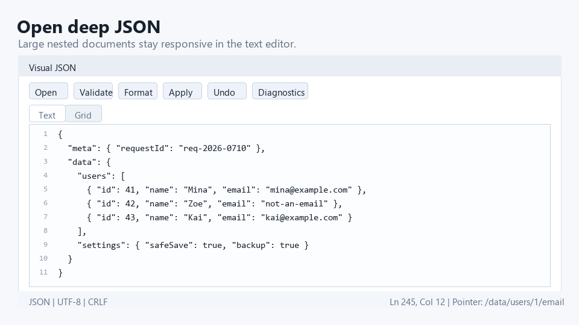
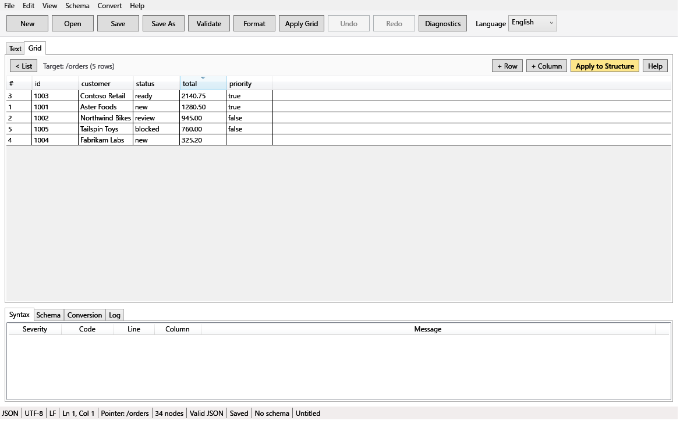
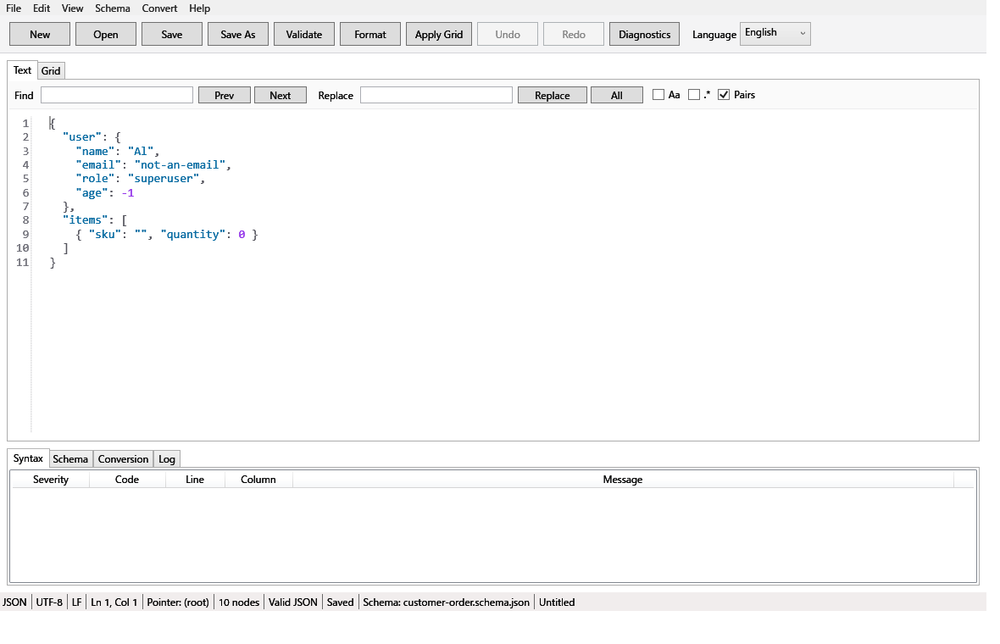

# Visual JSON

Visual JSON は VB.NET / WPF で実装した Windows-first の JSON エディタです。

English version: see [README.md](README.md).



## Visual JSON が向いている場面

| 機能 | VS Code | オンラインJSONツール | Visual JSON |
| --- | --- | --- | --- |
| ローカル完結 | ○ | × | ○ |
| グリッド編集 | 拡張依存 | 限定的 | 標準搭載 |
| Table View | 限定的 | 限定的 | 標準搭載 |
| Schema診断ジャンプ | ○ | 一部対応 | ○ * |
| XML/YAML変換preview | 一部対応 | 一部対応 | 標準搭載 |
| 保存前検証 / backup / recovery | 一部対応 | × | 標準搭載 |

\* Schema検証はJSON Schemaキーワードの実用サブセット対応です。`allOf`/`anyOf`/`oneOf`、`$id`、リモート`$ref` には対応しません。詳細は「制限」の節を参照してください。

## サンプルファイル

[`samples/`](samples/) には、Visual JSON の良さをすぐ試せるサンプルを同梱しています。

- [`api-response-invalid.json`](samples/api-response-invalid.json): [`schema/user.schema.json`](samples/schema/user.schema.json) と組み合わせて、Schema診断とクリックジャンプを試せます。
- [`users-array.json`](samples/users-array.json): Gridへ切り替えて、Table View、列ソート、セル編集を試せます。
- [`config.jsonc`](samples/config.jsonc): JSONCコメント、末尾カンマ、検証、整形を試せます。
- [`events.jsonl`](samples/events.jsonl): JSON Linesを配列相当ドキュメントとして開き、行形式で保存できます。

## Screenshots

| Table View | Schema diagnostics |
| --- | --- |
|  |  |

## 機能 (v1.2.0)

### JSON編集コア (MVP-0)

- 標準 `.json` ファイルを開き、AvalonEditベースの行番号・検索付きテキストモードで編集できます。描画と構文ハイライトは可視行のみに仮想化され、数MB級でも応答性を維持します。
- 極端に長い単一行(未整形の機械出力)を含むファイルは、開く際に整形を提案します。拒否した場合はそのまま開きます。
- テキスト変更後 500ms のデバウンスで構文チェックを実行し、行/列付きの診断を表示します。
- Syntax タブのエラークリックで本文位置へ移動できます。
- 正しいJSONを Key / Value / Type / JSON Pointer パス列の階層グリッドで確認できます。
- グリッドで値を編集し、整形JSONとしてテキストへ反映できます。
- 保存/名前を付けて保存の前に標準JSONとして検証します。
- 上書き保存前に世代バックアップを作成し、一時ファイル経由で置換保存します。
- 未保存編集の復旧スナップショットを作成し、次回起動時に復元/破棄を選べます。
- 診断情報コピーには JSON 本文を含めません(環境情報、サイズ、エラーコード、例外種別/スタックトレースのみ)。

### 実用JSON拡張 (MVP-1)

- `.jsonc` / `.json5` / `.jsonl` / `.ndjson` を同じテキスト/グリッド操作で開けます。
- JSON Lines は配列相当のツリーとして表示・フィルタできます。
- グリッドの操作列から子追加、兄弟追加、削除、上下移動、型変更、Undo ができます。セル編集の確定も1操作としてUndoに登録されます。
- Grip列から同一親内の行をドラッグして並べ替えられます。
- キー、値、型、パスでグリッドをフィルタし、親コンテキストを残して表示できます。
- メッセージペインを含む主要UIを英語/日本語で切り替えられます。

### JSON Schema検証 (MVP-2)

- ローカル JSON Schema を読み込み、ドキュメントを検証できます。
- 対応キーワード: `type` / `required` / `properties` / `additionalProperties` / `minimum` / `maximum` / `pattern` / `enum` / 配列 `items`。
- Schema診断は JsonPath、JSON Pointer、本文の行/列、SchemaPath、Schema URI を保持します。
- 診断クリックで本文位置へ移動し、Schema定義ビューで該当キーワード位置を確認できます。
- 外部 `$schema` URL の取得は**既定で無効**です。明示的に許可した場合も HTTPS のみ許可し、HTTP / `file:` / UNC / localhost / プライベート・リンクローカルIPへのリダイレクトはブロックします。ホスト名はDNS解決後の全IP(IPv4-mapped IPv6含む)も検査し、検証済みIPにのみ接続します。

### XML / YAML変換 (MVP-3)

- 現在のJSONをXMLへExportできます(`@name` は属性、`#text` は要素本文、配列は `item` 要素、必要に応じて `root` 要素を補完)。
- 現在のJSONを2スペースインデントのYAMLへExportできます。Number / Boolean / Null はYAML組み込み型を保持します。
- XML / YAML ファイルをJSONドキュメントとして開けます(元ファイルは変更しません)。
- すべてのExportは保存前にプレビューを表示し、キャンセルすれば何も変更しません。
- Exportは一時ファイル経由で書き込み、既存ファイルはバックアップします。変換失敗時に元ファイルは変更されません。
- XML読み込みでは DTD、外部エンティティ、外部サブセットを禁止します(XXE対策)。

### Phase2 R1 基盤

- テキスト/グリッド位置同期、折りたたみ、置換、検索ハイライトをR1受入ゲートで再検証します。
- `%LocalAppData%\VisualJson\settings.json` に言語、ウィンドウ配置、バックアップ設定、外部Schema許可、括弧補完、Schema探索パス、最近使ったファイルを保存します。
- 設定ファイル破損時は `settings.broken-<timestamp>.json` に退避し、初期値で起動します。
- 最近使ったファイルを最大10件表示し、履歴クリアと消失ファイルの自動除去に対応します。
- メインウィンドウへのドラッグ&ドロップでファイルを開けます。
- UTF-8 / UTF-8 BOM / UTF-16 LE / UTF-16 BE と CRLF / LF を判定し、保存時に維持します。
- 拡張子不明のファイルは JSON / JSONC / JSON5 / JSON Lines を内容から推定します。
- グリッド操作のRedo、ノード複製、行コンテキストメニュー、JSON Pointerコピー、テキスト位置ジャンプに対応します。
- `%LocalAppData%\VisualJson\logs` にファイルログを出力します。JSON本文やSchema本文は含めません。

### テーブルビュー・グリッド強化 (Phase2 R2)

- オブジェクトが過半数の配列を、グリッドのAction列から「行=要素、列=プロパティ」のテーブルビューで開けます。欠損プロパティは空セルで表示します。対象は1万行までで、超過時は警告してツリー表示のままにします。
- スカラーセルは既存の型推定規則で直接編集できます。空セルへの入力は、その行にのみプロパティを作成します。「+ 行」は末尾に空オブジェクト行を追加し、「+ 列」は表示列を追加して編集した行から実体化します。セル確定ごとに1 Undoです。
- 列ヘッダソートは表示のみを変更します。「構造へ反映」で表示順を配列へ書き込み(1 Undo)、「#」列で構造順に戻せます。
- 異なる親へのドラッグ&ドロップ移動に対応しました。キー重複時は確認のうえ一意化し、自分の子孫への移動は拒否します。
- 値セルに `{}` / `[]` と入力すると空のobject / arrayへ変換します。

### Schema・変換強化 (Phase2 R2)

- Schema検証に `const`、`minLength`/`maxLength`(コードポイント数)、同一文書内 `$ref`(`#/...`、循環検出・深さ上限32)、`format` 警告(`date-time`/`date`/`time`/`email`/`uri`)を追加しました。外部URLの `$ref` は警告として無視し、ネットワークアクセスは行いません。
- テキストモードで Ctrl+Space を押すと、同一配列内の兄弟オブジェクトのキー+Schemaの `properties` から既出キーを除いた補完候補を表示します。
- XML Exportのプレビューでオプションを選べます: 配列は `<item>` 要素(既定)/親名の繰り返し、nullは空要素(既定)/`xsi:nil="true"`。変更すると即時に再変換され、設定は保存されません。
- JSON Lines文書は1行1コンパクトJSONの行形式で保存します。エディタ表示は従来どおり配列相当の標準JSONです。互換性の注意はリリースノートを参照してください。

## 制限 (v1.2.0)

- JSONC / JSON5 は読み取り時に標準JSONへ正規化します。整形、グリッド同期、保存、変換後にコメントは保持されません(仕様上 best effort)。
- JSON5 対応は代表構文(コメント、シングルクォート文字列、未引用キー、末尾カンマ)に限定します。完全なJSON5エンジンではありません。
- JSON Lines は配列相当ドキュメントとして扱います。保存は行形式で、元ファイルの空行・行内書式は保持しません。
- Schema検証は上記キーワードのサブセット+R2拡張です。`allOf`/`anyOf`/`oneOf`、`$id`、リモート`$ref` には対応しません。
- YAML→JSON はブロックスタイルの代表サブセット対応です。アンカー、エイリアス、タグ、ブロックスカラー(`|`, `>`)、空でないフロー記法はエラーとして明示的に拒否します。
- XML→JSON は既定で値を文字列として保持します。
- 50MB以上のファイルはテキストモードで開き、そのセッションではフルグリッド編集を無効化します。
- 100MB級JSONの完全グリッド編集は保証しません。
- 約8,000文字を超える行はトークン着色なしで描画します(応答性優先)。極端に長い単一行を含むファイルは開く際に整形を提案します。
- テーブルビューのコンテナセル(object/array)は読み取り専用の要約表示です。ダブルクリックでツリーの該当ノードへ移動します。
- BSON、Split View、複数タブは後続フェーズ候補です。
- 初期配布は未署名のため、SmartScreen 警告が出る場合があります。配布時の SHA256 checksum を確認してください。

## ビルド

```powershell
dotnet build VisualJson.slnx
```

## 起動

```powershell
dotnet run --project src\VisualJson.App\VisualJson.App.vbproj
```

## テスト

```powershell
dotnet run --project tests\VisualJson.Tests\VisualJson.Tests.vbproj
```

## パッケージ作成

```powershell
.\scripts\package-windows-x64.ps1
```

成果物は `artifacts/` に出力されます。

- `visual-json-v1.2.0-win-x64.zip`
- `visual-json-v1.2.0-win-x64.sha256`

## ライセンス

ソースコードは Mozilla Public License Version 2.0 (MPL-2.0) です。詳細は [LICENSE](LICENSE) を参照してください。実行形式パッケージに対応する Source Code Form は、対応するGitHubタグ、たとえば [`v1.2.0`](https://github.com/Meistertech-JP/Visual-JSON/tree/v1.2.0) から取得できます。Visual JSON の名称、ロゴ、スクリーンショット、デモGIF、画像素材、プロジェクトのブランド表現は MPL-2.0 の対象外で、権利留保です。詳細は [NOTICE.md](NOTICE.md) を参照してください。AvalonEdit は MIT License のまま別枠です。詳細は [THIRD_PARTY_NOTICES.md](THIRD_PARTY_NOTICES.md) を参照してください。外部コントリビューションは DCO sign-off を必要とします。詳細は [CONTRIBUTING.md](CONTRIBUTING.md) を参照してください。
